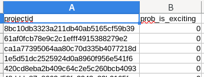

# PortfolioSubmission.jl
Submission template for MLinJulia Course at TU Kaiserslautern.

For more information about the submission code style click the invenia code badge below

# Submission Instructions

## Data Analysis Task.

For the Data Analysis task of the Portfolio, you are required to **update** the [**SampleSubmissions.csv**](src/samplesubmission.csv) csv file in this repo with your predictions (i.e For each id in the `projectid` column of the sample submission file, supply the corresponding value for `prob_is_exciting`). The snipshot shows the first 5 rows what a typical submission should look like.

 
    
 

You are also required to edit the [data_analysis_task.jl](src/data_analysis_task.jl) pluto notebook in this repo with detailed code showing how you preformed Exploratory Data Analysis (EDA), model training, evauluation predictions etc, and arrived at your predictions.(See Portfolio guide for more info).

## Implementation Task

For your chosen implementation task, your are required to update the [implementation_task.jl](src/implementation_task.jl) pluto notebook with your code submission.

## Reflection
Submit your portfolio reflection document by replacing the [relection.pdf](./reflection.pdf) file with an updated version with the same document name.

## Additional Notes
- To edit pluto notebooks use the pluto web enviroment
- If you made you of random sample and similar functionality in your code, please ensure that you use the random generators provided in [StableRNGs.jl](https://github.com/JuliaRandom/StableRNGs.jl) to ensure reproducibility.